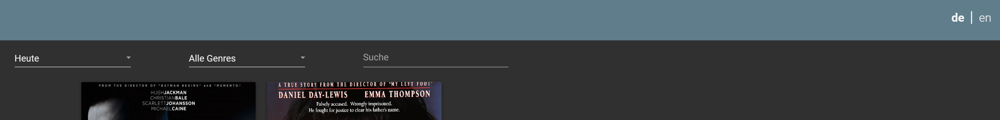
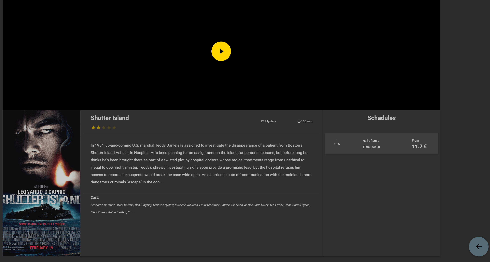
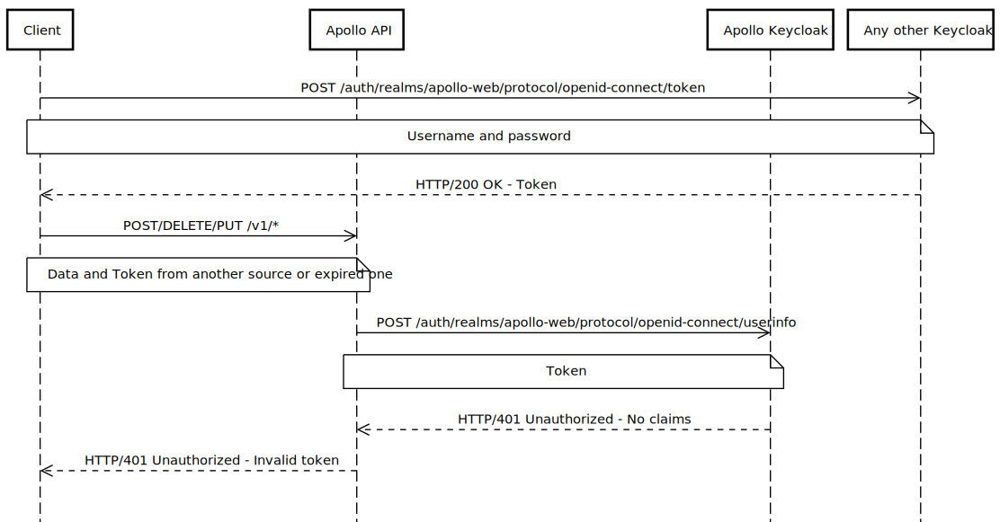

# Apollo 🚀

## Table of Contents
1. [Introduction](#introduction)
2. [Get Started](#get-started)
    1. [Necessary tools](#necessary-tools)
    2. [Setup](#setup)
    3. [Environment file](#environment-file)
    4. [Dockerized Databases](#dockerized-databases)
    5. [Backup Databases](#backup-databases)
    6. [Initial seed](#initial-seed)
    7. [Application Configuration](#application-configuration)
    8. [Start a Release](#start-a-release)
3. [Architecture](#architecture)
    1. [Database](#database)
    2. [Overview](#overview)
    3. [Responsibilities](#responsibilities)
4. [Usage](#usage)
    1. [Payment API](#payment-api)
    2. [Fluent SQL](#fluent-sql)
5. [Terminal Application](#terminal-application)
    1. [Mockup](#mockup)
    2. [Documentation](#documentation)
6. [API](#api)
    1. [Swagger](#swagger)
    2. [Authentication](#authentication)
    3. [API-Authorization with JWT](#api-authorization-with-JWT)
    4. [Configuration](#configuration)
    5. [Scenario: Infrastructure Management](#scenario-infrastrcuture-management)
    6. [Scenario: Schedule Management](#scenario-schedule-management)

## Introduction
Apollo is an application to manage cinema tickets. To sell tickets, it provides a WPF based
terminal application. Additionally, it provides a RestAPI to connect Web based client 
application. 


## Get started

### Necessary tools

 - Be sure you have [docker and docker-compose](https://www.docker.com/) installed in the latest version
 - Furthermore, you will need Linux or git-bash for Windows to execute the provided shell scripts

### Setup

 1. Clone this repository via ```git clone ```

 2. Switch to ```\apollo\docker``` folder

 3. Be sure to have the latest version of `docker-compose -version` >= version **1.27.4** and `docker -v`  >= **19.03.13**

 4. Open a terminal and execute the following command :  `docker-compose up -d` 

### Environment file
Inside the folder we provide you with a default `.env` file. This should not be delivered to staging or production environments.     
For the ease of use we have commited this file to ensure that the databases can be started easily. If you adapt the environment variables you have to adapt the `appsettings.json` too.

### Dockerized Databases
After you executed step 4. of the [Setup](#setup) section you should see the following containers running when you run the command `docker ps -a`:

|  Container 	                |  Port 	|   Responsibility	        |   	
|-------------------------------|-----------|---------------------------|	
|  apollo.dev.db 	            |   3306	|   Development Database	|   	
|  apollo.test.db 	            |   3307	|   Test Database	        |  
|  apollo.authentication.prod 	|   9000	|   Keycloak                |  
|  apollo.authentication.dev 	|   9001	|   Test Keycloak           |  
|  apollo.api                	|   8080	|   Apollo Rest API         |  


5. After you have verified that the containers are up and running you must copy the provided `apollo_dev_backup.sql.gz` dump file into ```\apollo\docker```
7. Run the `db_restore.sh` script which is located there to seed the development database

### Backup Databases
If you want to backup you current development database you can run the provided backup script. Run `db_backup.sh` to create a compressed file for your test and development database.     


### Initial seed
We created a simple console application with the project `Apollo.Import`. This importer fetches real data from [IMDB](https://imdb-api.com/) (Top 250 movies) and we parse this data to seed our own database.   
The API-Key is only valid until **18.11.2020**. Afer the expiration date you either have to provide you own API-KEY (Standard Subscription for 5000 Requests per day) or you must use the `apollo_dev_backup.sql.gz` file.

### Application Configuration

#### Terminal-Configuration
The property can be found in the corresponding [appsettings.json](Apollo/Apollo.Terminal/appsettings.terminal.json) 
file in the Terminal project.
The possible configuration options are listed below:

| Property name                     | Description                                                                           | Possible values                     | Unit    |
|-----------------------------------|---------------------------------------------------------------------------------------|-------------------------------------|---------|
| Inactive_Timeout                  | The time until the application resets their state and show the home screen            | Positive integer number             | Seconds |
| Play_Button_Inactive_Timeout      | The time until the play button of the video player disappears                         | Positive integer number             | Seconds |
| Apollo_Database                   | Connection string of the database                                                     | Valid database connection string    | -
| Bookable_Days                     | Count of bookable day from today on which are shown on the terminal                   | Positive integer number             | Days    |
| TerminalUser                      | UUID of the user which is used for the terminal                                       | Valid UUID string                   | -
| ReservationBufferMinutes          | Time until a movie can be booked before the start time                                | Positive integer number             | Minutes |
| OnScreen_Keyboard_Enabled         | If the Windows-On-Screen keyboard should appear after focusing an input element       | True | False                        | -       |
| VirtualOnScreen_Keyboard_Enabled  | If the integrated virtual keyboard should appear after focusing an input element      | True | False                        | -       |

#### API-Configuration
The property can be found in the corresponding [appsettings.json](Apollo/Apollo.Api/appsettings.json) 
file in the API project.
The possible configuration options are listed below:

| Property name         | Description                                                       | Possible values                     |
|-----------------------|-------------------------------------------------------------------|-------------------------------------|
| Apollo_Database       | Connection string of the database                                 | Valid database connection string    | 
| JWT_ENDPOINT          | URL with the used REALM of the authentication server              | Positive integer number             | 
| JWT_CLIENT            | Client-ID of the used client on the authentication server         | Valid UUID string                   |
| Port                  | Port where the API is reachable                                   | Positive integer number             |
| Logging               | Logging options for the API                                       | JSON structure                      |


### Start a Release

To start a released version, first download the desired version and extract it. Afterwards, navigate to subfolder
of the application you want to start.

#### Terminal
To start the terminal application, open the subfolder `terminal` and open the executable. To configure the
application, navigate into the `assets` folder and change the corresponding `appsettings.json` file.

#### API
To start the API, open the subfolder `api` and import the docker image. To import the docker image,
run following command:\
`docker load --input apollo.api-<version>.tar`

Afterwards the API is startable with the docker-compose file which is described in
 the section [Get Started](#get-started).

## Architecture

### Database


### Overview


### Responsibilities
#### Storage
This layer is responsible to store all necessary data. At the moment this storage is
a relational database.The layer above implements all necessary methods and accesses the 
storage (persistence) layer. This gives us the flexibility to change the Database without 
any migration pain.
\
\
We use two MariaDB databases to be able to perform tests without modifying the production
data. 

#### Data Access Object Helper
This class is responsible for wrapping the access to the underneath persistence layer. To 
achieve this, it gets an instance of a factory to create the connection dynamically based
on the configuration file.
\
\
We use this layer at the moment to perform the main SQL commands. There are Select, Update, 
Delete and Insert statements which we use inside this layer to perform SQL commands. All
commands are realized as Prepared Statements to avoid SQL injection. Additionally,
the implementation of this layer contains a functionality to perform database transactions. 

#### Fluent Entity
This class is responsible for making the Fluent SQL functionality accessible. This includes
all CRUD commands. Additionally, it contains predefined statements. For example, a statement
to select all data or only one row. Furthermore, it contains the transaction option. 

#### Fluent SQL
This layer is responsible for wrapping all SQL statements. As a result, it is possible
to write fluent code instead of old-fashioned SQL statements as plain string, that are not
type safe. All possible options are described in the section [Usage](#usage).

#### Domain
This layer describes the format of the data. In addition, this entities are used
to pass data through the layers. Every entity is identified by an unique ID. Furthermore,
these entities have some functionality to compare it with another instance of the same entity.

#### Data Access Object
This layer is responsible for loading data from the storage and pass it to the layer above.
Every entity has a separate data access object. The main reason for this is, to collect
all relevant queries in a single class. The DAO-Layer contains no business logic or validation.
On the one hand, it only checks if the given data is correct before it persists it. On the 
other hand, it can join tables to resolve one-to-one relationships.

#### Repository
This layer is responsible for handling all "database business logic". This means to combine
data access objects by business cases. One repository, calls in further consequence multiple
data access objects to achieve the necessary business case. This layer is also
responsible for making some sanity checks. For example, it should not be possible to add 
parallel movie schedules for the same cinema hall. Furthermore, wrap multiple statements into 
transactions. Furthermore, it wraps multiple statements into transactions. Nevertheless, 
this layer contains no general business logic. Middleware like logging can be easily used 
inside the repositories to provide developers with rich error messages. Logging messages
which are addressed the user should be placed in the business logic layer.

#### Unit of Work
This layer is responsible for wrapping all repositories. Therefore, all repositories should 
be lazy initialized and available as a Singleton objects. To access the repositories, the 
unit of work layer is used. It is not possible to access a repository directly.

#### Core
This layer represents the business logic. This means that all requests are delegated to 
the corresponding underlying layers. Primarily, the data are queried via the Unit of Work layer 
and subsequently from the database. However, other services such as the payment layer are 
also addressed. In addition, the external layer is addressed, for example to perform 
validations. 
All data are passed to higher layers in the form of Data Transfer Objects. These layer 
maps the underlying data into exactly these projects.

#### DTO
This layer contains Data Transfer objects. These are used to transport data to higher layers. 

#### Payment Adapter
This layer puts a wrapper over the access to external payment APIs. This has the advantage that 
the same interface can always be used internally. Only an adapter has to be created for a new 
payment interface. In addition, the corresponding data must of course be delivered to the API.

#### External
This layer offers the possibility to add external interfaces. Currently, this is used to implement 
external seat validators. In concrete terms, it is exactly this interface that is used for 
Corona-conform seat validation. This means that if new guidelines arise here, the application 
itself does not need to be changed.

#### Terminal
This is the WPF application that is started on the terminals in the cinema to handle the booking 
process. Additionally, this application offers the possibility to get information about the movie 
program. Details, prices and trailers for the films are displayed. If a reservation and payment 
has been made successfully, the ticket can be printed.

## Usage

### Payment API

The payment API is an interface to implement external payment methods for this project. The 
interface looks like this:
```C#
public interface IPaymentApi<in TMethod> where TMethod: IPaymentMethod
{
    Task TransactionAsync(decimal amount, string description, TMethod method);
}
```
As first parameter it expects the amount in Euro. The second one describes the transaction. This
means the text, that should appear on the debit. The third parameter contains the necessary
payment method data.

#### Payment Method

##### Base
The base payment method is only an empty interface. To implement a payment method, you must
derive from this payment method interface.
```C#
public interface IPaymentMethod
{
}
```

##### Apollo Credit Card
The payment method "Apollo Credit Card" is one implementation of the `IPaymentMethod`. It holds
all data which are mandatory for a credit card. The class looks like:
```C#
public class ApolloCreditCard: IPaymentMethod
{
    public string CardNumber { get; set; }
    public string OwnerName { get; set; }
    public DateTime OwnerBirthday { get; set; }
    public DateTime Expiration { get; set; }
    public string Cvr { get; set; }
}
```

### Fluent SQL

#### Entity Attributes

##### EntityTableAttribute
This attribute is necessary to mark a class as an entity. It owns a single field which  is the
name of the data source. If you use a relational database, it indicates the table name.

Example
```C#
[EntityTable("table_name")]
public class Entity
{
    ...
}
```

##### EntityColumnAttribute
This attribute is necessary to mark a property as an entity entry. It owns one mandatory
field which describes the entity entry name. In addition, it contains an optional field
to signal that this entity entry is a key. If you use a relational database, the first property
is the column name inside the table. The second one, mark it as primary key.

Example
```C#
...
public class ...
{
    ....
    [EntityColumn("entry_name", true)]
    public long Property { get; set; }
    ...
}
```

##### EntityColumnRefAttribute
This attribute is necessary to mark a property as an entity reference entry. It owns one
mandatory field which describes the referenced entity name.  If you use a relational database, 
it is a foreign key. The field name is the name of the referenced table.

Example
```C#
...
public class ...
{
    ....
    [EntityColumnRef("referenced_table_name")]
    public object RefTable { get; set; }
    ...
}
```

#### Query

##### Select
Fluent SQL Select provides fluent methods to retrieve data from the database. It packs the
result data into objects. Also, joining multiple tables and linking the result in objects 
are supported. But, joins are restricted to 1:1 relations.

###### Syntax Diagram 


###### Example
Select
```C#
Select<MovieTest>()
    .Column(cw => cw.Id)
    .Column(cw => cw.Title)
    .ColumnRef<GenreTest, string>(gt => gt.Name)
    .ColumnRef<ActorTest, string>(at => at.FirstName)
    .InnerJoin<MovieTest, GenreTest, long, long>(mt => mt.Genre, mt => mt.GenreId, gt => gt.Id)
    .InnerJoin<MovieTest, MovieActorTest, long, long>(mt => mt.MovieActor, mt => mt.Id, mat => mat.MovieId)
    .InnerJoin<MovieActorTest, ActorTest, long, long>(mt => mt.MovieActor.Actor, mt => mt.ActorId, at => at.Id)
    .Where(_ => _.Id)
    .GreaterThan(15000)
    .And(_ => _.Id)
    .LowerThan(30000)
    .Order()
    .ByDescending(_ => _.Id)
    .ByDescending(_ => _.Genre.Name)
    .Limit(10);
```

SelectAll
```C#
SelectAll<MovieTest>()
    .InnerJoin<MovieTest, GenreTest, long, long>(mt => mt.Genre, mt => mt.GenreId, gt => gt.Id)
    .InnerJoin<MovieTest, MovieActorTest, long, long>(mt => mt.MovieActor, mt => mt.Id, mat => mat.MovieId)
    .InnerJoin<MovieActorTest, ActorTest, long, long>(mt => mt.MovieActor.Actor, mt => mt.ActorId, at => at.Id)
    .Limit(10);
```

##### Insert
Fluent SQL Insert is pretty simple in usage. Its possible to insert single entities or enumerations of multiple entities.    
The example below shows how multiple Cinema entities are inserted. The insert itself is asynchronous and is performed with     
the execute statement.
###### Syntax Diagram 


###### Example
```C#
 var cinemaHalls = new List<CinemaHall>
            {
                new CinemaHall {Id = 1L, Label = "Cinema-1"},
                new CinemaHall {Id = 2L, Label = "Cinema-2"},
                new CinemaHall {Id = 3L, Label = "Cinema-3"},
                new CinemaHall {Id = 4L, Label = "Cinema-4"},
                new CinemaHall {Id = 5L, Label = "Cinema-5"}
            };
var cinemaHallIds = await _fluentEntity.InsertInto(cinemaHalls)
                                       .ExecuteAsync();
```

##### Update
Fluent SQL Update works a bit different than a usual SQL update statement. It is necessary to pass one or multiple entities to the update       
method of Fluent SQL. The changed properties will be updated after the execute statement is performed. Furthermore, it is not possible      
to add a WHERE clause with conditions.
###### Syntax Diagram 


###### Example
```C#
 var horrorGenre = await _fluentEntity.SelectAll<Genre>()
                .Where(genre => genre.Name)
                .Equal("Horror")
                .QuerySingleAsync();

 const string horrorAdventure = "Horror-Adventure";

 horrorGenre.Name = horrorAdventure;

var updateCount = await _fluentEntity.Update<Genre>(horrorGenre)
                                     .ExecuteAsync();
```
##### Delete
Fluent SQL Delete is similiar designed like native SQL statements. You can currently use multiple conditions and chain them      
to perform a conditional deletion. After the delete statement is executed the method returns the deleted amount of rows.
###### Syntax Diagram 


###### Example
```C#
 await _fluentEntity.Delete<Genre>()
                .Where(genre => genre.Name)
                .Equal("Horror")
                .Or(genre => genre.Id)
                .GreaterThan(5)
                .And(genre => genre.Name)
                .StartsWith("Fan")
                .ExecuteAsync();
```

##### Transaction
Fluent SQL Transaction provides fluent methods to perform database transactions.

###### Syntax Diagram 


###### Example
Perform
```C#
FluentTransaction()
    .Perform(_entityManager.FluentEntity().InsertInto(new GenreMock
    {
        Id = 1,
        RowVersion = DateTime.Now,
        Name = "Horror"
    }))
    .Perform(_entityManager.FluentEntity().InsertInto(new GenreMock
    {
        Id = 2,
        RowVersion = DateTime.Now,
        Name = "Drama"
    }))
    .Commit();
```

PerformBlock
```C#
.FluentTransaction()
    .PerformBlock(async () =>
    {
        await _entityManager.FluentEntity().InsertInto(new GenreMock
        {       
            Id = 1,
            RowVersion = DateTime.Now,
            Name = genreName
        }).ExecuteAsync();
        await _entityManager.FluentEntity().InsertInto(new MovieMock
        {
            Id = 1,
            RowVersion = DateTime.Now,
            Description = "Demo",
            Duration = 1,
            GenreId = 1,
            Image = new byte[] { },
            Title = movieTitle,
            Trailer = "empty"
        }).ExecuteAsync();
    })
    .Commit();
```

## Terminal Application

### Mockup


### Documentation

#### Startscreen
The user must click on the screen to access the film overview. If nothing is done 
on the terminal for a certain time, the user returns to this view.


#### Language selection
The user can change the language of the application by clicking on the 
individual shortcuts. Currently Apollo only supports English and German as languages because the target group is the DACH-market.



#### Movie overview
The user sees an overview of the films. The corresponding tag can be selected via 
a combo box. Afterwards all movies which are still playing on that day can be seen. 
      


If no movies are currently playing on this day, because the schedules have already started, the user will not see any movie but a proper message is displayed.
     

Furthermore, it is possible to filter by genre or film title. By clicking on the 
film, the details and the booking process are displayed.


#### Movie details
In this view the user can inform himself about the film. In addition, there is the 
possibility to watch a trailer, if available.      

After a click on the play button the trailer starts. 
    

If you click on the movie again, you have the possibility to pause the trailer with the Pause button. 
In addition, by clicking on the appropriate time, you can access the booking process.


#### Select seat
In this view you have the possibility to select the desired seats. By visualization you can 
see which seats are occupied, locked, free or currently selected. White seats a are free, grey seats are already reserved and locked seats are a mixture of grey color and stripes.
The user is visually informed which seats he/she has selected in form of yellow highlighted seats.
Additionally, in the upper right corner you can see how many seats are currently selected and how many can still be selected. 


If an invalid combination was entered and an attempt is made to continue, a corresponding error 
message appears. The validation rules can be added or removed regarding to the current situation. In the scenario below     
the validation rules are that seast must be in the same row , a block of seats can only be reserved and there must be at least one free seat between different reservations.

     

Furthermore, the selection of already reserved or locked seats is prevented by showing an error message.
  

#### Payment
In this view, you will now be prompted to enter the payment method. You can also see 
how many tickets are booked and how much the total price is.

If there are any errors during the payment process we display an appropriate message for the user in form of a snackbar.
   

On top of the that all fields are validated. That means it is not possible to enter invalid credit card numbers or cvcs beforehand.


#### Checkout
Once you have reached this page, the reservation has been made successfully. Afterwards the 
ticket can still be printed. If you now click on continue, the booking process is completed 
and you will return to the film overview.


After clicking the printing button a printing dialog opens and the user is able to print his/her ticket. In a producitve environment the user would send it directly to the printer omitting this dialog,
but for testing purpose it is shown that the ticket is correctly saved as an PDF document.
     

In the end you can see the printed ticket as a PDF document.


## API

### Swagger
This projects uses Swagger-Open-API documentation for visualizing the endpoints. The descriptions and return values are generated via a XML document which is automatically generated. The only necessity during the development process is 
that it is obligatory to use XML-comments for each endpoint method.     


``` 
c.SwaggerDoc("v1", new OpenApiInfo
                {
                    Version = "v1",
                    Title = "Apollo API",
                    Description = "The legendary Apollo cinema API.",
                    TermsOfService = new Uri("https://example.com/terms"),
                    Contact = new OpenApiContact
                    {
                        Name = "Rudolf Hermanseder and Michael Eder",
                        Email = "info@fh-hagenberg.at",
                        Url = new Uri("https://www.fh-ooe.at/en/hagenberg-campus/")
                    },
                    License = new OpenApiLicense
                    {
                        Name = "MIT",
                        Url = new Uri("https://opensource.org/licenses/MIT"),
                    }
                });
```
The middleware automatically generates from the OpenApiInfo the API documentation in form of an [HTML document](http://localhost:5000/swagger/index.html) which is automatically served).

     
      
     
     
     

    

### Authentication
The client has to request the authentication server for a token, before he can make calls to restricted endpoints.
To get a valid token, you must provide a valid client id, username and password. After a successful check you 
get a response with the token. This token has to be forwarded to the Apollo API. Afterwards, the Apollo API requests
the authentication resource server to validate the given token. If the token is valid it gets the containing
claims back. Consequently, the API checks if the given UUID represents a valid user in the database. If this is the
case, it compares the role of the user with the necessary endpoint roles. If this roles match, the request
can be forwarded to the controller and back to the client.

#### Scenario: Valid token and role
 

#### Scenario: Invalid username or password
 

#### Scenario: Invalid token
 

### API-Authorization with JWT
The authorization process is configured to work with Swagger. The user can identify the secured endpoints via lock symbols. To access those endpoints for operations like **PUT-, POST- and DELETE**-request you have to open send a POST-request with your credentials to our **Keycloak** server. 
If the credentials are valid, you receive a **JWT** which can be used to access the protected routes.  


Open the authorization dialog via presssing this button on the Swagger site.          
      

Enter your JWT and you can access all endpoints even the protected ones.
     


### Configuration

The followoing configuration is used in the `Startup.cs`:

|      Name                                             |            Description                  |
|-------------------------------------------------------|-----------------------------------------|
| AddRouting(options => options.LowercaseUrls = true)   |  Routes can be lowercase or not         |
| UseCors(config => config.AllowAnyOrigin())            |  Disables CORS policy                   |
| UseAuthentication()                                   |  Enables Authentication for endpoints   |
| UseAuthorization()                                    |  Enables AUthorization for endpoints    |


### Scenario: Infrastructure Management
 

### Scenario: Schedule Management
 
